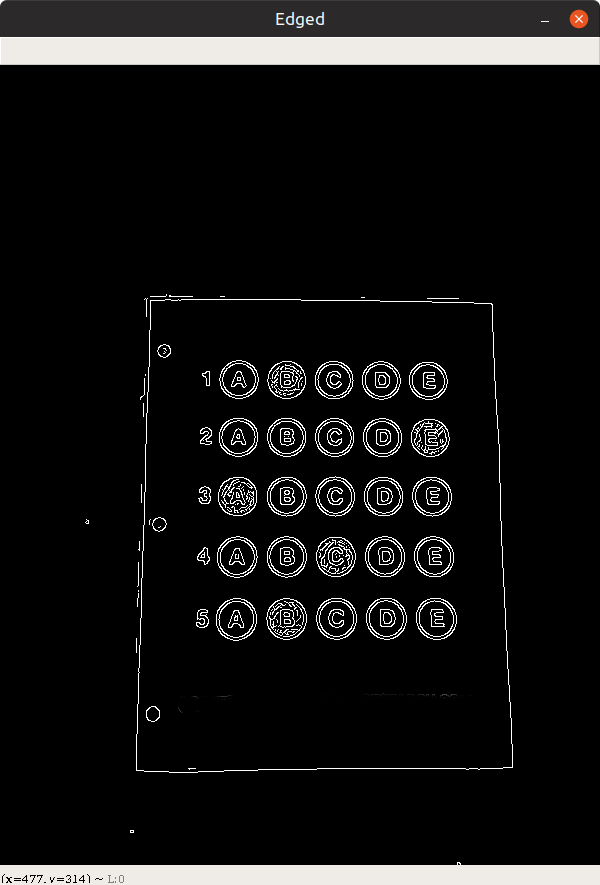
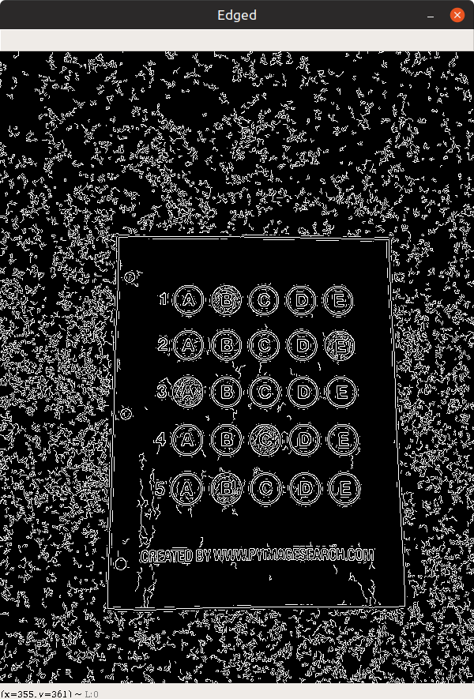
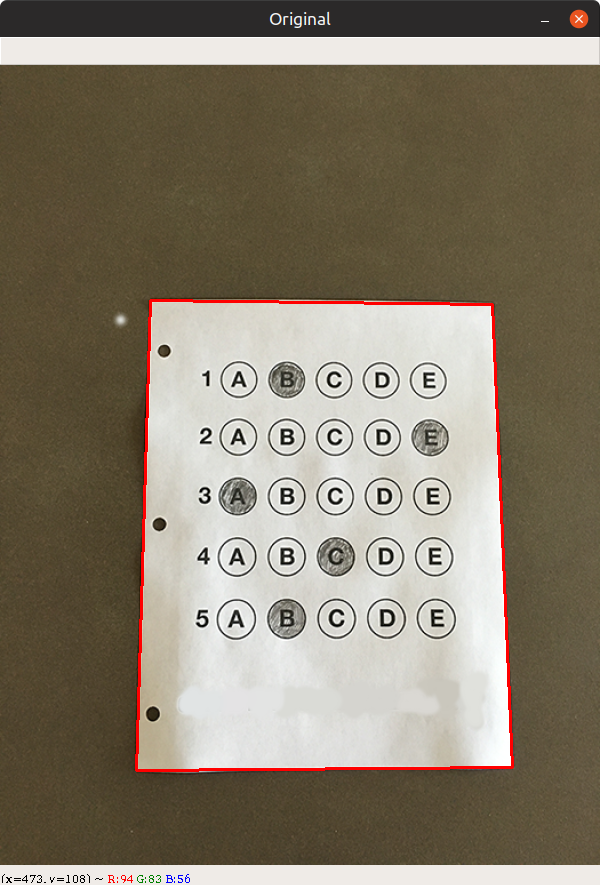
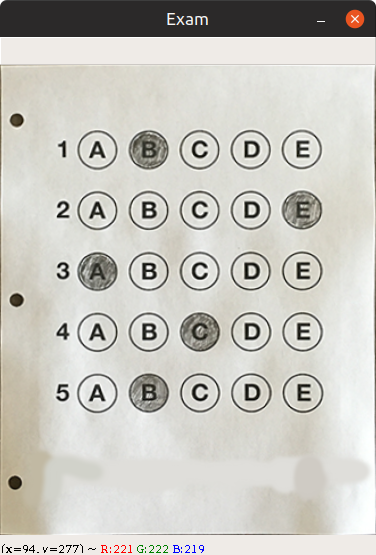
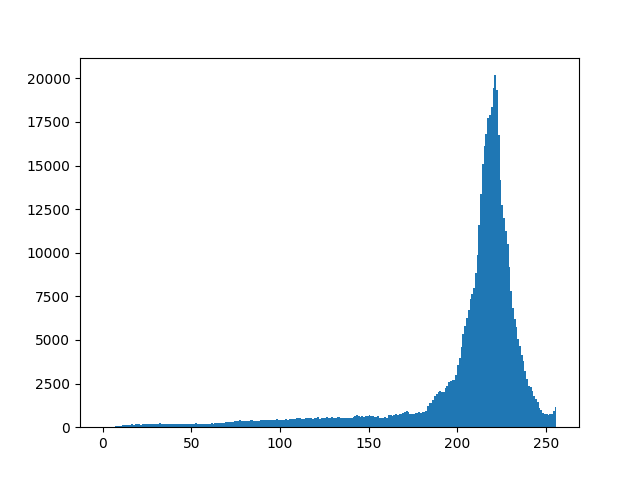
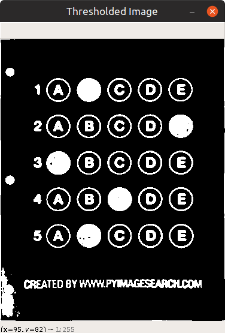
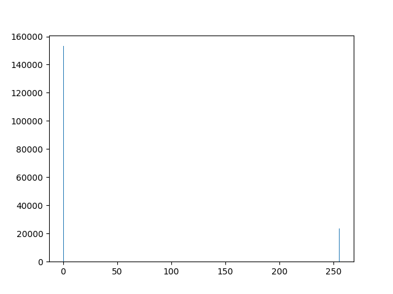
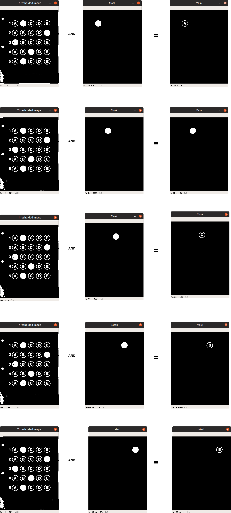
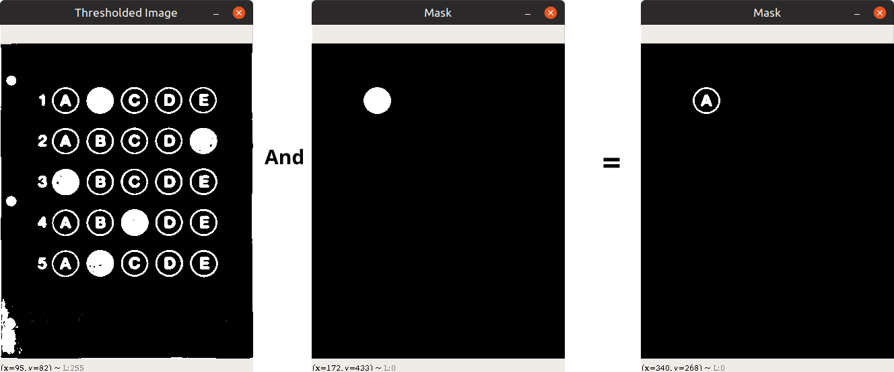

# OMR SCANNER

This is a project that will be using some image processing techniques to evaluate the OMR Sheet.
Much of help is taken from [this blog by pyimageSearch. Give it a read.](https://www.pyimagesearch.com/2016/10/03/bubble-sheet-multiple-choice-scanner-and-test-grader-using-omr-python-and-opencv/)

## How this works?

I will try to explain as effectively as possible.

This has mainly **4 steps**:

1. Do the edge detection.
2. Find the corner points of paper and apply perpective transform.
3. Do the thresholding.
4. Extract the question and detect the answer(_using masking_)

## Algorithm

1. Find the edges of paper and do the **perpective transform** to get the **bird's eye view** of paper.
2. Do binarisation of image for simplicity.
3. Find the options contours.
4. Loop over each option and find **how many pixels are white**.
5. Calculate the score.

### Step#1 Edge Detection

Before doing edge detection we do

- Black and White
- Blur

#### Why do we do this?

We do this because,

- Black and white image has only 1 shade of color mainly black. This helps in easy computation of pixel values as we don't have to compute on different channels(**Mainly RGB**).

Code for Black and white.
`cv2.cvtColor(image, cv2.COLOR_BGR2GRAY)` returns black and white image.

- Blurring the image will **reduce the noise**.

`cv2.GaussianBlur(gray, (5, 5), 0)` returns blurred image.


#### Code for edge detection

```py
# gray it
gray = cv2.cvtColor(image, cv2.COLOR_BGR2GRAY)
# blur it
gray = cv2.GaussianBlur(gray, (5, 5), 0)
# canny edge detection
edged = cv2.Canny(gray, 5, 10)
```

##### Why to use gaussian blur?

**With blur.**



**Without blur**



### Step#2 Perpective transform

We will use edged image to find contours and filter out the largest contour.

**Code for finding countours.**

```py
cnts = cv2.findContours(edged.copy(), cv2.RETR_EXTERNAL,
                        cv2.CHAIN_APPROX_SIMPLE)
```

We have used Return Method _RETR_EXTERNAL_. Learn more about openCV return method and heirarchy. [Click here!](https://docs.opencv.org/3.4.2/d9/d8b/tutorial_py_contours_hierarchy.html)

We have used [CHAIN_APPROX_SIMPLE](https://docs.opencv.org/3.3.1/d4/d73/tutorial_py_contours_begin.html) for optimisation.

```py
cnts = cv2.findContours(edged.copy(), cv2.RETR_EXTERNAL,
                        cv2.CHAIN_APPROX_SIMPLE)

cnts = cnts[0] if imutils.is_cv2() else cnts[1]
docCnts = None
if len(cnts) > 0:
    cnts = sorted(cnts, key=cv2.contourArea, reverse=True)
    for c in cnts:
        # calc the perimeter
        peri = cv2.arcLength(c, True)
        approx = cv2.approxPolyDP(c, 0.02*peri, True)
        if len(approx) == 4:
            docCnts = approx
            break
```

**Finding the largest contour**



```py
# apply perspective transform to the shape
paper = four_point_transform(image, docCnts.reshape(4, 2))
```

**After applying perspective transform.**



### Step#3 Thresholding

We will be using **Otsu's thresholding method**. To learn more about threshholding [read here!](https://docs.opencv.org/3.4/d7/d4d/tutorial_py_thresholding.html)

One thing to know about **Otsu's method is that it works on bimodal images.** But sometimes when **uneven lighting condition** is the case Otsu's method **fails**.

When we plot histogram for paper image we get the following histogram.




**Otsu method** has chosen **175 or rgb(175, 175. 175) or #afafaf** as threshold.


**X-axis**: is color shade.
**Y-axis**: no of pixel for that color.

#### After thresholding



Histogram is



You can see that there is either **0(white)** or **255(black)** pixels in **Thresholded image**.

### Step#4 Masking

This part is one of my favourite as this part consist of clever techniques.

#### How do we extract if the filled bubble?

Well the answer is in the given pic. Take your time and have a **good look at this pic**. Only after you have observed the pic carefully you may move on.



`click on the image to view in full size`

##### Solution Approach

We are looping over each questions and options as:

`for (q, i) in enumerate(np.arange(0, len(questionCnts), 5)):`

`(q,i) = (0, 0) (q,i) = (1, 5) (q,i) = (2, 10) (q,i) = (3, 15) (q,i) = (4, 20) (q,i) = (5, 25)`

We are then sorting contours from `questionCnts[i:i+5]` in _left to right_ manner

```py
cnts = contours.sort_contours(questionCnts[i:i+5])[0]
```

Above code does that.

##### Here comes the masking

```py
    for (j, c) in enumerate(cnts):
        mask = np.zeros(thresh.shape, dtype='uint8')
        cv2.drawContours(mask, [c], -1, 255, -1)
        # apply the mask to the thresholded image, then
        # count the number of non-zero pixels in the
        # bubble area
        mask = cv2.bitwise_and(thresh, thresh, mask=mask)
        total = cv2.countNonZero(mask)
        # if total > current bubbled then
        # bubbled = total
        # print('total', total, 'bubbled', bubbled)
        if bubbled is None or bubbled[0] < total:
            # if total > bubble_thresh:
            #     bubble_count += 1
            bubbled = (total, j)
```

What we are basically doing is this:



Have you got that? No?

Never mind!

- First we are making a image of same size of _thresholded image_.
- Second we are making a mask for each countour in _questionCnts_
- Now we have mask with a black background and white bubble.
- What will happen if we **bitwise and** the _thresholded image_ and _mask_. The result will be the last image in above pic!

**Now take a look at the above image again.**

We are doing this for each and every bubble in that image.

We are now **counting** the no of **white pixel** in **final mask**.

`total = cv2.countNonZero(mask)`

total stores the no of white pixel in each final mask.

if total > current bubbled then

```python
if bubbled is None or bubbled[0] < total:
    bubbled = (total, j)
```

**Marked Bubbled will have largest no of pixels.**

Hell yeah! :) This is the main logic.

You can dive deep into the code to gain more knowledge.

### Issues

- The Quality of image shown in first test is super duper good. It is _evenly lit and high res_. When we take photo from camera the it is not that good.
- Moreover the real omr does not have only single row but it also has _multiple rows_.

#### Expectation

Our image in theory is this.


#### Reality

Actually Image from camera is unevenly lit. Notice how the image is bright from the center and dark on the edges. Image is not even that clear as compared to "_Expectation_".


**This creates many issues. Move to project issues to know more.**
